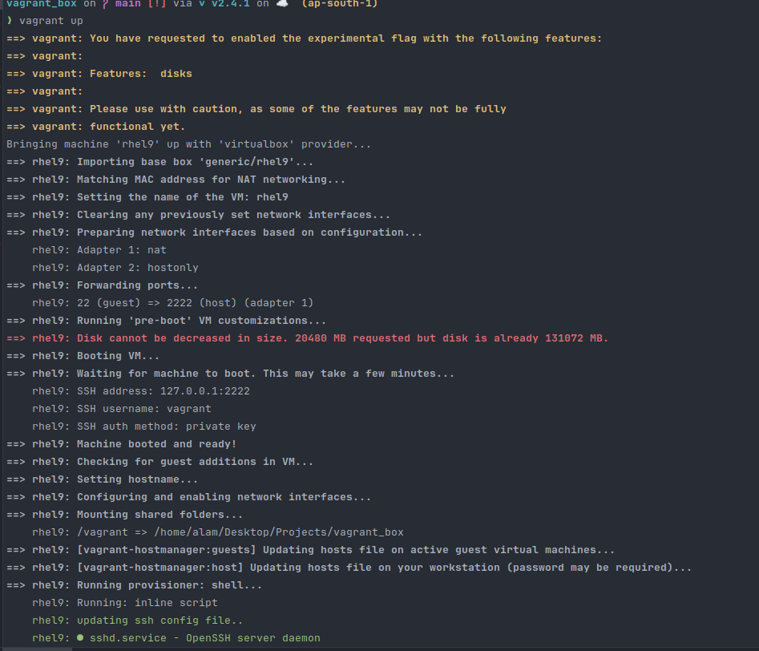

# **STEPS TO CREATE VIRTUAL BOX USING VAGRANT**
1. Install Vagrant: https://developer.hashicorp.com/vagrant/install
2. Verify vagrant is installed:-
   
3. Install Virtualbox: https://www.virtualbox.org/wiki/Downloads
4. Verify Virtualbox installed:
   ❯ which virtualbox
   /usr/bin/virtualbox
5. Clone git repo: got clone https://github.com/maifujalam/vagrant_box.git 
6. Go to the repo folder: cd vagrant_box 
7. Add the following line in bashrc file:- 
   a. vi ~/.bashrc
   b. Add lines:-
   export VAGRANT_EXPERIMENTAL="disks"
   c. save with !wq [ followed by enter key]
8. Install shell auto completion [ Optional] 
    a. vagrant autocomplete install
9. To start vagrant box for rhel 9:-  
   a. vagrant up [ To start up the virtual machine.It will download vagrant box of around 1.2GB]  
   b. It will prompt to download plugin.So type yes to download it.   
   c. After box is downloaded,it will boot the vm.  

     
10. To check to vagrant vm status: vagrant status  

    

11. To ssh to the vagrant vm: vagrant ssh rhel9
12. To stop the vagrant vax: vagrant halt rhel9
13. To delete the vagrant box: vagrant destroy rhel9