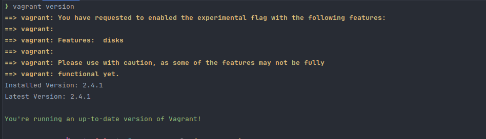

# **STEPS TO CREATE VIRTUAL BOX USING VAGRANT**
1. Install Vagrant: https://developer.hashicorp.com/vagrant/install
2. Verify vagrant is installed:-
3. 
4. Install Virtualbox: https://www.virtualbox.org/wiki/Downloads
5. Verify Virtualbox installed:  
    $ `which virtualbox `  
       /usr/bin/virtualbox  
6. Clone git repo: `git clone https://github.com/maifujalam/vagrant_box.git`
7. Go to the repo folder: `cd vagrant_box `
8. Add the following line in bashrc file:-   
   a. `vi ~/.bashrc`  
   b. Add below lines:-  
        export VAGRANT_EXPERIMENTAL="disks"  
   c. Save with `!wq` [ followed by enter key]
9. Install shell auto completion [ Optional ]   
    a.  `vagrant autocomplete install`
10. To start vagrant box for rhel 9:-  
    a. `vagrant up` [ To start up the virtual machine.It will download vagrant box of around 1.2GB]  
    b. It will prompt to download plugin.So type yes to download it.   
    c. After box is downloaded,it will boot the vm.   
      
11. To check to vagrant vm status: `vagrant status`  
    

12. To ssh to the vagrant vm: vagrant ssh rhel9 [Note:- rhel9 is the name of vm we get from status command]  
    
13. To ssh from any other path: `ssh vagrant@192.168.56.56` (username: vagrant password: vagrant)
    
14. To stop the vagrant vax: `vagrant halt rhel9` [Note:- vagrant ssh onl works from project directory where vagrant file is present ]
    
15. To delete the vagrant box: `vagrant destroy rhel9`
    
16. Youtube video demo: https://youtu.be/7FYm10dpIUo 
